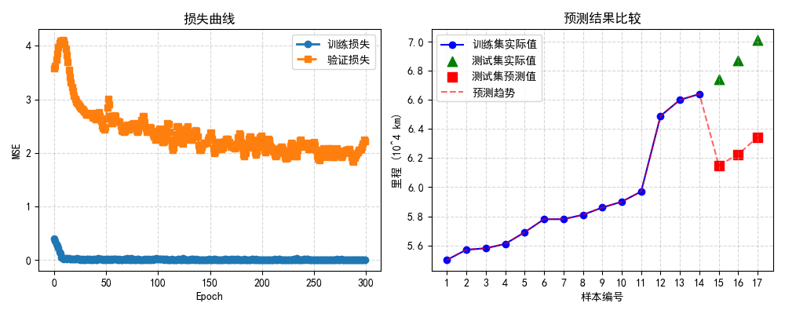
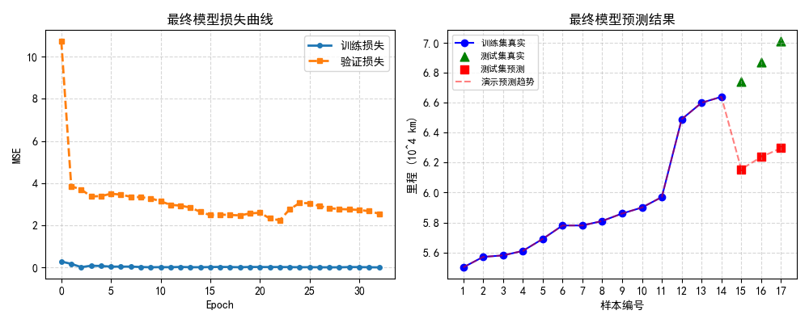
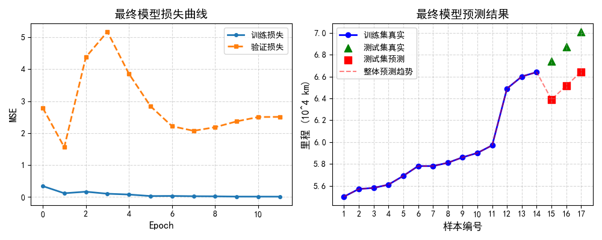

# WOA - CNN and BWO - CNN

## 1. woa_cnn

代码 `woa_cnn.py`，主要流程：

- 载入数据并标准化；

- 定义 **CNN 构建函数** `build_cnn_model`，接受一组超参数（“鲸鱼位置”），返回编译好的 `Model`；

- 定义**适应度函数** `fitness_function`：给定一组超参数，在训练集上训练CNN（只跑很少论述或 `validation_split`），返回验证集上的均方误差 `MSE` 作为适应度值；

- 实现鲸鱼优化算法 `WOA`：随机初始化 `N` 条鲸鱼（没条鲸鱼对应一个浮点向量，对应若干超参数），迭代更新位置，记录全局最优超参数；

- 用最优超参数重新训练最终 CNN，输出预测结果并可视化。

---

### 1.1 环境配置

开发环境：`Anaconda` + `pycharm`

配置虚拟环境：

```bash
# 新建一个conda环境，命名为CNN
conda create -n CNN python=3.8 -y
conda activate CNN

# 安装必要的软件包
pip install tensorflow==2.12.0  # 深度学习框架
pip install scikit-learn==1.2.2  # 数据预处理和标准化
pip install numpy==1.23.5  # 数值计算
pip install pandas==1.5.3  # 数据处理
pip install matplotlib==3.7.1  # 可视化，可选
pip install tqdm  # 进度条工具，可选
```

----

### 1.2 鲸鱼优化算法原理

鲸鱼优化算法，Whale Optimization Algorithm，又称**鲸鱼群智优化算法**，模拟座头鲸的**气泡捕食策略行为**。

WOA算法将优化问题的搜索空间想象成海洋，将潜在解视为鲸鱼，最优解视为鱼群位置，算法通过三种行为寻找最优解：

- **包围猎物**，Encircling Prey
- **气泡网攻击**，Bubble-net Attacking
  - **收缩包围机制**，Shrinking Encircling
  - **螺旋更新位置**，Spiral Updating
- **随机搜索猎物**，Search for Prey

---

#### 1.2.1 包围猎物

流程：

- 识别猎物位置将其包围；
- 假设每时刻鲸鱼种群中位置最好鲸鱼（暂时最优解）；
- 其它鲸鱼向该最优个体靠近，最终得到一个最靠近猎物的位置（全局最优解）。

**位置更新公式**：计算当前个体与暂时最优个体之间的距离、更新当前位置
$$
\overrightarrow{D}=\left|\overrightarrow{C}\cdot\overrightarrow{X^*}(t)-\overrightarrow{X}(t)\right|
\tag{1}
$$

$$
\overrightarrow{X}(t+1)=\overrightarrow{X}^{*}(t)-\overrightarrow{A}\cdot\overrightarrow{D}
\tag{2}
$$

其中：

- $\overrightarrow{X}(t)$：当前鲸鱼位置（第 $t$ 代）；
- $\overrightarrow{X^{*}}(t)$：当前**最优鲸鱼位置**；
- $\overrightarrow{A} = 2\overrightarrow{a} \cdot \overrightarrow{r_1} - \overrightarrow{a}$：**控制其它鲸鱼移动方向**；
- $\overrightarrow{C} = 2 \cdot \overrightarrow{r_2}$：控制鲸鱼探索强度；
- $\overrightarrow{a}$：收敛因子，随迭代线性递减；
- $\overrightarrow{r_1}, \overrightarrow{r_2}$：[0,1] 内的随机向量。

---

#### 1.2.2 气泡网攻击

- **收缩包围机制** (Shrinking Encircling)

  - 本质上是前面式 (1) 展示的包围猎物的机制；
  - 关键在于，随着迭代进行，收敛因子 $a$ 线性减少也会使得系数向量 $A$ 震荡范围减小，当 $|\overrightarrow{A}| < 1$ 时：

  
  $$
  a = a_{max} - t \cdot \frac{a_{max}}{T_{max}} \tag{3}
  $$

  $$
  \overrightarrow{X}(t+1) = \overrightarrow{X^{*}}(t) - \overrightarrow{A} \cdot \overrightarrow{D} \tag{4}
  $$

  

  - 随着 $A$ 的减小，鲸鱼向最优个体的可移动幅度也越来越小，实现**搜索空间的收缩包围**。

- **螺旋更新位置** (Spiral Updating)

  - 模拟鲸鱼沿着螺旋路径向猎物移动；
  - 位置更新公式：

  $$
  a=a_{max}-t\cdot\frac{a_{max}}{T_{max}} \tag{5}
  $$

  - 其中，$\overrightarrow{D'} = | \overrightarrow{X^{*}}(t) - \overrightarrow{X}(t) |$ 为当前鲸鱼个体到最优个体的距离向量，同式 (1)。
  - **选择机制**：以 **50%** 概率选择**收缩**或**螺旋**更新：

  $$
  \overrightarrow{X}(t+1)=
  \begin{cases}
  \overrightarrow{X}^{*}(t)-\overrightarrow{A}\cdot\overrightarrow{D} & \mathrm{if~}p<0.5 \\
  \overrightarrow{D}^{t}\cdot e^{bl}\cdot\cos(2\pi l)+\overrightarrow{X}^{*}(t) & \mathrm{if~}p\geq0.5 & 
  \end{cases} 
  \tag{6}
  $$

----

#### 1.2.3 随机搜索猎物

- 前面两个都是基于鲸鱼发现了猎群，当当所有的鲸鱼都很远时，采用随机选择某鲸鱼展开包围；
- 体现在，当 $|\overrightarrow{A}| \geq 1$ 时，进行全局探索：

$$
\overrightarrow{D}=
\begin{vmatrix}
\overrightarrow{C}\cdot\overrightarrow{X_{rand}}-\overrightarrow{X}
\end{vmatrix} 
\tag{7}
$$

$$
\overrightarrow{X}(t+1)=\overrightarrow{X_{rand}}-\overrightarrow{A}\cdot\overrightarrow{D} 
\tag{8}
$$

- 其中，$\overrightarrow{X_{rand}}$ 为随机选择的鲸鱼个体。

---

### 1.3 材料与方法

#### 1.3.1 数据预处理

- 原始数据：

```python
# 原始数据
data = np.array([
    [5.33, 5.39, 5.29, 5.41, 5.45, 5.50],
    [5.39, 5.29, 5.41, 5.50, 5.57, 5.57],
    [5.29, 5.41, 5.45, 5.50, 5.57, 5.58],
    [5.41, 5.45, 5.50, 5.57, 5.58, 5.61],
    [5.45, 5.50, 5.57, 5.58, 5.61, 5.69],
    [5.50, 5.57, 5.58, 5.61, 5.69, 5.78],
    [5.57, 5.58, 5.61, 5.69, 5.78, 5.78],
    [5.58, 5.61, 5.69, 5.78, 5.78, 5.81],
    [5.61, 5.69, 5.78, 5.78, 5.81, 5.86],
    [5.69, 5.78, 5.78, 5.81, 5.86, 5.90],
    [5.78, 5.78, 5.81, 5.86, 5.90, 5.97],
    [5.78, 5.81, 5.86, 5.90, 5.97, 6.49],
    [5.81, 5.86, 5.90, 5.97, 6.49, 6.60],
    [5.86, 5.90, 5.97, 6.49, 6.60, 6.64],
    [5.90, 5.97, 6.49, 6.60, 6.64, 6.74],
    [5.97, 6.49, 6.60, 6.64, 6.74, 6.87],
    [6.49, 6.60, 6.64, 6.74, 7.87, 7.01]
])
```

- 归一化：

```python
scaler_X = StandardScaler()
X_train_scaled = scaler_X.fit_transform(X_train)
scaler_y = StandardScaler()
y_train_scaled = scaler_y.fit_transform(y_train.reshape(-1, 1)).flatten()
```

作用：**加速CNN收敛，防止梯度爆炸**。

- 时间序列重塑以满足 CNN 输入需要的 3D 格式 ：**[samples, timesteps, features]**

```python
X_train_3d = X_train_scaled.reshape((X_train_scaled.shape[0], X_train_scaled.shape[1], 1))
X_test_3d  = X_test_scaled.reshape((X_test_scaled.shape[0], X_test_scaled.shape[1], 1))
```

作用：将一维数据转换为三维张量，符合一维卷积：**Conv1D**

---

#### 1.3.2 CNN 构建函数

CNN结构：

- 输入层：输入形状(5, 1)，表示时间步长为5，每个时间步有1个特征；

- **第一个卷积层**：滤波器数量为 $f_1$ ，卷积核大小为 $2$，激活函数为 $ReLu$，填充方式采用 $same$；
- **第二个卷积层**：滤波器数量为 $f_2$ ，卷积核大小为 $2$，激活函数为 $ReLu$，填充方式采用 $same$；
- 全局最大池化层：提取整个序列最大值；
- **全连接层**：$Dense$ 层，单元数为 $f_c$；
- $Dropout$ 层：固定值 $0.2$；
- 输出层：$Dense$ 层，单元数为 $1$，回归任务输出。

将可调节的**超参数**封装成一个列表，例如：

- `filters1`：第一个 Conv1D 的滤波器个数，取值范围：16–128 之间的整数；
- `filters2`：第二个 Conv1D 的滤波器个数，取 8–64 之间的整数；
- `dense_units`：全连接层的神经元个数，取 16–128 之间的整数；
- `lr`：学习率，取值范围：1e-4–1e-2 之间。

代码：

```python
def build_cnn_model(hyperparams):
    """
    根据传入的 hyperparams 构建并返回编译后的 CNN 模型。
    hyperparams: 长度为4的可迭代对象，对应 [filters1, filters2, dense_units, lr]
    """
    # 从超参数中解析出各个数值
    f1 = int(round(hyperparams[0]))  # 第一层卷积滤波器个数
    f2 = int(round(hyperparams[1]))  # 第二层卷积滤波器个数
    fc = int(round(hyperparams[2]))  # 全连接层单元数
    lr = float(hyperparams[3])       # 学习率（浮点数）
	
    # 构建模型
    model = Sequential([
        Conv1D(filters=f1, kernel_size=2, activation='relu', padding='same', input_shape=(5, 1)),
        Conv1D(filters=f2, kernel_size=2, activation='relu', padding='same'),
        GlobalMaxPooling1D(),
        Dense(fc, activation='relu'),
        Dropout(0.2),
        Dense(1)
    ])
    optimizer = Adam(learning_rate=lr) # 学习率
    model.compile(optimizer=optimizer, loss='mse', metrics=['mae'])
    return model
```

---

#### 1.3.3 适应度函数

对于WOA算法，每个鲸鱼都对应一个超参数向量，我们需要进行评估该向量对应的CNN在验证集上的表现：

- 评价指标：均方误差，MSE
- 为加快搜索速度：
  - `epoch`：每个CNN模型训练次数；
  - `validation_split=0.2`：使用20%的训练集做验证；
  - `batch_size`：每次训练时处理的样本数，可设定为较小值。
- `loss`：损失，是衡量模型预测结果与真实值之间差异的指标，也称为**损失函数（Loss Function）**或**目标函数（Objective Function）**。它的作用是指导模型在训练过程中如何调整参数（如权重和偏置），使预测值尽可能接近真实值。

代码：

```python
def fitness_function(hyperparams):
    """
    给定一组超参数 hyperparams，构建 CNN，并在训练集上训练，返回验证集上的 MSE 作为适应度值。
    hyperparams: np.array([f1, f2, fc, lr])
    """
    # 先把超参数限制在合理范围内，否则不给出很差的适应度
    # 例如 f1 ∈ [16, 128], f2 ∈ [8, 64], fc ∈ [16, 128], lr ∈ [1e-4, 1e-2]
    f1, f2, fc, lr = hyperparams
    if not (16 <= f1 <= 128 and 8 <= f2 <= 64 and 16 <= fc <= 128 and 1e-4 <= lr <= 1e-2):
        return 1e6  # 如果超参数越界，就给一个极大损失

    # 构建模型
    model = build_cnn_model(hyperparams)

    # 训练时只跑很少轮数，例如 30 轮
    early_stop = EarlyStopping(monitor='val_loss', patience=5, restore_best_weights=True)
    history = model.fit(
        X_train_3d, y_train_scaled,
        epochs=30,
        batch_size=4,
        verbose=0,
        validation_split=0.2,
        callbacks=[early_stop]
    )

    # 取最后一个 epoch 的 val_loss 作为适应度（或直接用 history.history['val_loss'] 的最小值）
    val_mse = min(history.history['val_loss'])
    # Keras 返回的 loss 就是  MSE
    return val_mse
```

---

#### 1.3.4 WOA 的实现

对四个超参数应用WOA进行优化，实现思路：

- 随机初始化 `N` 只鲸鱼，每只鲸鱼的位置向量 `X[i]` 在 `[bounds_min, bounds_max]`，分别为 $f1$、$f2$、$fc$、$lr$  的上下界随机生成；

- 每代计算所有鲸鱼的适应度，记录当前全局最优鲸鱼 `X_best`；

- 对于第 $t$ 代，使用 WOA 的位置更新公式来更新每只鲸鱼的位置：

  - 计算收敛系数 `a = 2 - 2 * (t / MaxIter)`，以及控制鲸鱼 `A = 2*a*r - a`，其中 `r ∈ [0,1]` 随机；

  - **根据概率 `p=0.5` 来决定是“包围猎物”和“螺旋更新”哪一种方式**。

- 循环到 `MaxIter`，得到 `X_best` 作为最优超参数。

代码：

```python
import random

def whale_optimization(n_whales=10, max_iter=20):
    """
    简化版 WOA：在 4 维超参数空间中搜索最优点。
    n_whales: 鲸鱼数量
    max_iter: 最大迭代次数
    """
    # 4 维的范围： [f1_min, f1_max], [f2_min, f2_max], [fc_min, fc_max], [lr_min, lr_max]
    lb = np.array([16, 8, 16, 1e-4])   # 下界
    ub = np.array([128, 64, 128, 1e-2]) # 上界

    dim = 4  # 超参数维度

    # 1. 随机初始化 n_whales 只鲸鱼的位置
    X = np.random.uniform(low=lb, high=ub, size=(n_whales, dim))
    fitness = np.full(n_whales, np.inf)

    # 先评估一次初始鲸鱼的适应度
    for i in range(n_whales):
        fitness[i] = fitness_function(X[i])

    # 记录全局最优
    best_idx = np.argmin(fitness)
    X_best = X[best_idx].copy()
    best_fit = fitness[best_idx]

    # 2. 迭代更新
    for t in tqdm(range(max_iter), desc="WOA 优化进度"):
        a = 2 - 2 * (t / max_iter)  # a 从 2 线性减到 0

        for i in range(n_whales):
            r1 = random.random()
            r2 = random.random()
            A = 2 * a * r1 - a
            C = 2 * r2
            p = random.random()

            if p < 0.5:
                # 包围猎物或搜索猎物
                if abs(A) < 1:
                    # 靠近最优鲸鱼 X_best
                    D = abs(C * X_best - X[i])
                    X_new = X_best - A * D
                else:
                    # 随机选择另一只鲸鱼 X_rand
                    rand_idx = random.randint(0, n_whales - 1)
                    X_rand = X[rand_idx]
                    D = abs(C * X_rand - X[i])
                    X_new = X_rand - A * D
            else:
                # 螺旋更新公式
                D_best = abs(X_best - X[i])
                b = 1  # 螺旋常数，一般取 1
                l = random.uniform(-1, 1)
                X_new = D_best * np.exp(b * l) * np.cos(2 * np.pi * l) + X_best

            # 越界检查：如果超出边界，就裁剪回 [lb, ub]
            X_new = np.clip(X_new, lb, ub)
            # 重新评估适应度
            f_new = fitness_function(X_new)

            # 如果新位置更好，则更新鲸鱼 i 的位置
            if f_new < fitness[i]:
                X[i] = X_new.copy()
                fitness[i] = f_new

            # 更新全局最优
            if f_new < best_fit:
                X_best = X_new.copy()
                best_fit = f_new

        # 每一代结束，可以打印当前最优适应度
        # print(f"第 {t+1} 代，最优验证 MSE = {best_fit:.6f}")

    return X_best, best_fit
```

---

## 2. bwo_cnn

代码文件 `bwo_cnn.py`，核心流程：

- 定义要优化的**超参数空间**，如：**滤波器个数**、**全连接层单元数**、**学习率**等；

- 实现一个**适应度函数**，给定一组超参数时，训练一个简化版的 CNN 并返回验证集 MSE；

- 用 BWO 算法迭代搜索最优超参数：

  - 采用 Beluga Whale（白鲸）新的更新策略；

  - 记录并更新全局最优。

- 用找到的最优超参数重新训练最终的 CNN，并输出预测结果与可视化。

---

### 2.1 环境配置

开发环境：`Anaconda` + `pycharm`

配置虚拟环境：

```bash
# 新建一个conda环境，命名为CNN
conda create -n CNN python=3.8 -y
conda activate CNN

# 安装必要的软件包
pip install tensorflow==2.12.0  # 深度学习框架
pip install scikit-learn==1.2.2  # 数据预处理和标准化
pip install numpy==1.23.5  # 数值计算
pip install pandas==1.5.3  # 数据处理
pip install matplotlib==3.7.1  # 可视化，可选
pip install tqdm  # 进度条工具，可选
```

---

### 2.2 白鲸优化算法

鲸鱼优化算法，Beluga Whale Optimization Algorithm，又称**白鲸群智优化算法**，模拟的白鲸。

不同于WOA算法，BWO算法中白鲸的行为分为：

- **自由泳**：三维空间的自由移动；
- **合作狩猎**：捕食行为；
- **鲸落现象**：某个体被遗忘，促进种群更新。

---

#### 2.2.1 探索阶段：自由泳

模拟白鲸在三维空间中的自由游动，如俯仰、滚转、偏航：
$$
\overrightarrow{X}_{i}^{t+1}=
\begin{cases}
\overrightarrow{X}_{i,j}^{t}+(\overrightarrow{X}_{r_{j}}^{t}-\overrightarrow{X}_{i,j}^{t})\cdot(1+r_{1})\cdot\sin(2\pi r_{2}), & j\text{ 为偶数维 } \\
\overrightarrow{X}_{i,j}^{t}+(\overrightarrow{X}_{r_{j}}^{t}-\overrightarrow{X}_{i,j}^{t})\cdot(1+r_{1})\cdot\cos(2\pi r_{2}), & j\text{ 为奇数维 }
\end{cases}
\tag{9}
$$
其中，

- $\overrightarrow{X_{i}^{t}}$：第 $i$ 只白鲸在第 $t$ 代的位置；
- $\overrightarrow{X_{r}^{t}}$：随机选择的个体位置；
- $j$：当前维度，奇偶维度分别用正弦和余弦模拟不同运动；
- $r_1, r_2$：[0,1] 内的随机数；
- $\sin/\cos$ 项：模拟三维空间中的旋转动作。

同时随迭代递减的**平衡因子**：
$$
B_f=B_0\cdot(1-t/(2T_{max})) \tag{10}
$$
其中，

- $B_0$：初始平衡因子，通常 $B_0 \in [0.1,0.3]$；
- 当 $r_3 < B_f$ 时执行游泳行为，$r_3$为[0,1]随机数。

----

#### 2.2.2 开发阶段：合作狩猎

模拟白鲸合作围捕鱼群向最优个体聚集的行为，即：
$$
\overrightarrow{X_i^{t+1}}=r_4\cdot\overrightarrow{X_{best}^t}-r_5\cdot\overrightarrow{X_i^t}+C_1\cdot\overrightarrow{L}\cdot(\overrightarrow{X_r^t}-\overrightarrow{X_i^t})
\tag{11}
$$


其中，

- $\overrightarrow{X_{best}^t}$：当前最优个体位置；
- $r_4, r_5$：[0,1] 内的随机数；
- $C_1$：跳跃强度，$C_1 = 2r_4$；
- $\overrightarrow{L}$：莱维飞行步长，增强全局搜索能力，当 $r_3 \geq B_f$ 时执行捕食行为：

$$
\overrightarrow{L}=\frac{0.05\times u\times\sigma}{|v|^{1/\beta}} \tag{12}
$$

---

#### 2.2.3 鲸落阶段：避免陷入局部最优

模拟白鲸死亡沉入海底，避免种群陷入局部最优，筛选规则：
$$
\overrightarrow{X_i^{t+1}}=r_6\cdot\overrightarrow{X_{best}^t}-r_7\cdot\overrightarrow{X_r^t}+C_2\cdot\overrightarrow{F}\cdot\overrightarrow{X_{step}}\tag{13}
$$
其中，

- $r_6, r_7$：[0,1] 内的随机数；
- $C_2$：鲸落强度，$C_2 = 2W_f \cdot n$，$n$为种群大小；
- $\overrightarrow{F}$：随机方向向量，元素为-1或1；
- $\overrightarrow{X_{step}}$：鲸落步长：

$$
\overrightarrow{X_{step}}=(u_b-l_b)\cdot\exp(-C_3\cdot t/T_{max}) \tag{14}
$$

以概率 $W_f$ 选择部分个体进行更新，鲸落概率随迭代递减：
$$
W_f=0.1-0.05\cdot t/T_{max} \tag{15}
$$

---

### 2.3 材料与方法

####  2.3.1 数据预处理

代码：

```python
# 原始数据
data = np.array([
    [5.33, 5.39, 5.29, 5.41, 5.45, 5.50],
    [5.39, 5.29, 5.41, 5.50, 5.57, 5.57],
    [5.29, 5.41, 5.45, 5.50, 5.57, 5.58],
    [5.41, 5.45, 5.50, 5.57, 5.58, 5.61],
    [5.45, 5.50, 5.57, 5.58, 5.61, 5.69],
    [5.50, 5.57, 5.58, 5.61, 5.69, 5.78],
    [5.57, 5.58, 5.61, 5.69, 5.78, 5.78],
    [5.58, 5.61, 5.69, 5.78, 5.78, 5.81],
    [5.61, 5.69, 5.78, 5.78, 5.81, 5.86],
    [5.69, 5.78, 5.78, 5.81, 5.86, 5.90],
    [5.78, 5.78, 5.81, 5.86, 5.90, 5.97],
    [5.78, 5.81, 5.86, 5.90, 5.97, 6.49],
    [5.81, 5.86, 5.90, 5.97, 6.49, 6.60],
    [5.86, 5.90, 5.97, 6.49, 6.60, 6.64],
    [5.90, 5.97, 6.49, 6.60, 6.64, 6.74],
    [5.97, 6.49, 6.60, 6.64, 6.74, 6.87],
    [6.49, 6.60, 6.64, 6.74, 7.87, 7.01]
])

# 输入特征：前5 列；目标：第6 列
X = data[:, :5]
y = data[:, 5]

# 前14 条做训练，后 3 条做测试
X_train = X[:14, :]
y_train = y[:14]
X_test  = X[14:, :]
y_test_true = y[14:]   # 真实值

# 数据标准化
scaler_X = StandardScaler()
X_train_scaled = scaler_X.fit_transform(X_train)
X_test_scaled  = scaler_X.transform(X_test)

scaler_y = StandardScaler()
y_train_scaled = scaler_y.fit_transform(y_train.reshape(-1, 1)).flatten()

# 重塑为 CNN 输入所需 3D 形状：[样本数, 时间步长, 特征数]
X_train_3d = X_train_scaled.reshape((X_train_scaled.shape[0], X_train_scaled.shape[1], 1))
X_test_3d  = X_test_scaled.reshape((X_test_scaled.shape[0], X_test_scaled.shape[1], 1))
```

---

#### 2.3.2 CNN构建函数

代码：
```python
def build_cnn_model(hyperparams):
    """
    根据超参数向量构建并返回编译好的 CNN 模型。
    hyperparams: 长度为 4 的可迭代对象，对应 [filters1, filters2, dense_units, lr]
    """
    # 解析并转换超参数
    f1 = int(round(hyperparams[0]))      # Conv1D 第一层滤波器个数
    f2 = int(round(hyperparams[1]))      # Conv1D 第二层滤波器个数
    fc = int(round(hyperparams[2]))      # 全连接层神经元个数
    lr = float(hyperparams[3])           # 学习率

    model = Sequential([
        Conv1D(filters=f1, kernel_size=2, activation='relu', padding='same', input_shape=(5, 1)),
        Conv1D(filters=f2, kernel_size=2, activation='relu', padding='same'),
        GlobalMaxPooling1D(),
        Dense(fc, activation='relu'),
        Dropout(0.2),
        Dense(1)
    ])
    optimizer = Adam(learning_rate=lr)
    model.compile(optimizer=optimizer, loss='mse', metrics=['mae'])
    return model
```

---

#### 2.3.3 适应度函数

代码：
```python
def fitness_function(hyperparams):
    """
    给定超参数向量 hyperparams，构建 CNN 并短轮次训练，
    返回验证集上的最低 MSE 作为适应度值（目标是最小化该值）。
    hyperparams: np.array([f1, f2, fc, lr])
    """
    # 限制超参数在合理区间，否则返回一个很大的惩罚值
    f1, f2, fc, lr = hyperparams
    if not (16 <= f1 <= 128 and 8 <= f2 <= 64 and 16 <= fc <= 128 and 1e-4 <= lr <= 1e-2):
        return 1e6

    # 构建模型并训练少量 epoch
    model = build_cnn_model(hyperparams)
    early_stop = EarlyStopping(monitor='val_loss', patience=5, restore_best_weights=True)
    history = model.fit(
        X_train_3d, y_train_scaled,
        epochs=30,
        batch_size=4,
        verbose=0,
        validation_split=0.2,
        callbacks=[early_stop]
    )

    # 返回验证集上最小 val_loss（MSE）
    val_mse = min(history.history['val_loss'])
    return val_mse
```

----

#### 2.3.4 BWO 的实现

代码：
```python
def beluga_whale_optimization(n_whales=10, max_iter=20):
    """
    Beluga Whale Optimization (BWO)：
    用于在 4 维超参数空间中搜索最优值。
    n_whales: 鲸鱼数量
    max_iter: 最大迭代次数
    返回：(最优超参数向量, 最优适应度)
    """
    # 每个维度的边界：[f1_min, f1_max], [f2_min, f2_max], [fc_min, fc_max], [lr_min, lr_max]
    lb = np.array([16, 8, 16, 1e-4], dtype=float)
    ub = np.array([128, 64, 128, 1e-2], dtype=float)
    dim = 4  # 4 维超参数

    # 1. 随机初始化 n_whales 条 Beluga Whale 的“位置”向量
    X = np.random.uniform(low=lb, high=ub, size=(n_whales, dim))
    fitness = np.full(n_whales, np.inf)

    # 先评估初始鲸鱼的适应度
    for i in range(n_whales):
        fitness[i] = fitness_function(X[i])

    # 记录全局最优
    best_idx = np.argmin(fitness)
    X_best = X[best_idx].copy()
    best_fit = fitness[best_idx]

    # 2. 迭代更新位置
    for t in tqdm(range(max_iter), desc="BWO 优化进度"):
        # Beluga Whale 特有参数：让搜索更加“探索-开发”自适应
        # 这里我们用 r1, r2 控制收敛率，用 b 控制螺旋系数
        a = 2 - 2 * (t / max_iter)   # a 从 2 线性减小到 0

        for i in range(n_whales):
            r1 = random.random()
            r2 = random.random()
            A = 2 * a * r1 - a         # A 控制“包围”或“探索”
            C = 2 * r2                 # C 控制搜索范围
            b = 1                      # 常数，螺旋更新时用到
            l = random.uniform(-1, 1)  # 用于螺旋公式中的随机项

            p = random.random()
            if p < 0.5:
                # —— Beluga“包围猎物”/“随机搜索”机制 —— 
                if abs(A) < 1:
                    # 靠近当前全局最优鲸鱼 X_best
                    D = np.abs(C * X_best - X[i])
                    X_new = X_best - A * D
                else:
                    # 选一只随机鲸鱼 X_rand，进行探索
                    rand_idx = random.randint(0, n_whales - 1)
                    X_rand = X[rand_idx]
                    D = np.abs(C * X_rand - X[i])
                    X_new = X_rand - A * D
            else:
                # —— Beluga“螺旋更新”机制 —— 
                D_best = np.abs(X_best - X[i])
                # 这里的 BWO 螺旋：在 WOA 基础上增加一个随机系数 b
                X_new = D_best * np.exp(b * l) * np.cos(2 * np.pi * l) + X_best

            # 新位置做边界限制
            X_new = np.clip(X_new, lb, ub)

            # 评估新位置的适应度
            f_new = fitness_function(X_new)
            if f_new < fitness[i]:
                X[i] = X_new.copy()
                fitness[i] = f_new

            # 更新全局最优
            if f_new < best_fit:
                X_best = X_new.copy()
                best_fit = f_new

        # （可选）每代结束时打印最优适应度
        # print(f"第 {t+1} 代：最优验证 MSE = {best_fit:.6f}")

    return X_best, best_fit
```

---

## 3. 实验与讨论

### 3.1 实验结果

**纯CNN预测结果**：

```txt
Model: "sequential"
_________________________________________________________________
 Layer (type)                Output Shape              Param #   
=================================================================
 conv1d (Conv1D)             (None, 5, 64)             192       
                                                                 
 conv1d_1 (Conv1D)           (None, 5, 32)             4128      
                                                                 
 conv1d_2 (Conv1D)           (None, 5, 16)             1040      
                                                                 
 global_max_pooling1d (Globa  (None, 16)               0         
 lMaxPooling1D)                                                  
                                                                 
 dense (Dense)               (None, 50)                850       
                                                                 
 dropout (Dropout)           (None, 50)                0         
                                                                 
 dense_1 (Dense)             (None, 1)                 51        
                                                                 
=================================================================

测试集预测结果：
样本 15: 真实值 = 6.7400, 预测值 = 6.1498
样本 16: 真实值 = 6.8700, 预测值 = 6.2257
样本 17: 真实值 = 7.0100, 预测值 = 6.3448
模型评估 (测试样本):
均方误差 (MSE): 0.401979
平均绝对误差 (MAE): 0.633231
样本17预测值: 6.3448 (10^4 km)
```

训练效果：




**woa_cnn预测结果**：

```txt
WOA 优化进度: 100%|██████████| 30/30 [06:33<00:00, 13.13s/it]
WOA 优化完成，最优超参数（f1, f2, fc, lr）= [1.28e+02 6.40e+01 1.28e+02 1.00e-02]
对应验证集最小 MSE = 0.347145
实际采用的超参数：filters1=128, filters2=64, dense_units=128, lr=0.01000

最终模型在测试集上的预测结果：
样本15：真实值=6.7400，预测值=6.1562，误差=-0.5838
样本16：真实值=6.8700，预测值=6.2374，误差=-0.6326
样本17：真实值=7.0100，预测值=6.2971，误差=-0.7129
```

训练效果：



**bwo_cnn预测效果**：

```txt
WOA 优化进度: 100%|██████████| 30/30 [06:33<00:00, 13.13s/it]
WOA 优化完成，最优超参数（f1, f2, fc, lr）= [1.28e+02 6.40e+01 1.28e+02 1.00e-02]
对应验证集最小 MSE = 0.347145
实际采用的超参数：filters1=128, filters2=64, dense_units=128, lr=0.01000

最终模型在测试集上的预测结果：
样本15：真实值=6.7400，预测值=6.1562，误差=-0.5838
样本16：真实值=6.8700，预测值=6.2374，误差=-0.6326
样本17：真实值=7.0100，预测值=6.2971，误差=-0.7129
```

训练及预测效果：



----

### 3.2 讨论

